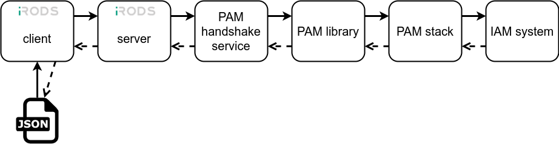

# irods_auth_plugin_pam_interactive

## Installation

1. Install iRODS 4.2.7 or 4.2.8 for CentOS

2. Install yum-plugin-priorities

```
yum install yum-plugin-priorities
```
(see https://wiki.centos.org/PackageManagement/Yum/Priorities)

3. Configure surf yum repository
```
sudo vi /etc/yum.repos.d/surf-irods.repo
```

**4.2.7**
```
[SURF]
name=SURF
baseurl=https://artie.ia.surfsara.nl/artifactory/DMS-RPM-Testing-Public/Centos/7/irods-4.2.7/master
enabled=1
gpgcheck=0
priority=90
#Optional - if you have GPG signing keys installed, use the below flags to verify the repository metadata signature:
#gpgkey=artie.ia.surfsara.nl/artifactory/DMS-RPM-Testing-Public/7/irods-4.2.7/master/repomd.xml.key
#repo_gpgcheck=1
```

**4.2.8**
```
[SURF]
name=SURF
baseurl=https://artie.ia.surfsara.nl/artifactory/DMS-RPM-Testing-Public/Centos/7/irods-4.2.8/master
enabled=1
gpgcheck=0
priority=90
#Optional - if you have GPG signing keys installed, use the below flags to verify the repository metadata signature:
#gpgkey=artie.ia.surfsara.nl/artifactory/DMS-RPM-Testing-Public/7/irods-4.2.7/master/repomd.xml.key
#repo_gpgcheck=1
```

4. clear cache

```
yum clean all
```

5. Update icommands

```
yum update irods-icommands
```

6. Install additional packages

```
yum install python-pam-module
```

install module (with workaround):

```
rpm --nodeps -i https://artie.ia.surfsara.nl/artifactory/DMS-RPM-Testing-Public/Centos/7/irods-4.2.8/master/x86_64/Packages/irods_auth_plugin_pam_interactive-0.1.0-<LATEST>.x86_64.rpm
```
(this is a workaround for yum install irods_auth_plugin_pam_interactive)

Install patched icommands
```
rpm --nodeps -i https://artie.ia.surfsara.nl/artifactory/DMS-RPM-Testing-Public/Centos/7/irods-4.2.8/master/x86_64/Packages/irods-icommands-4.2.8-<LATEST>.x86_64.rpm
```

## Usage and configuration



The auth plugin can handle conversations with an arbitrary list of challenges driven by the PAM stack.
Users can trigger a conversation from a icommand (e.g. iinit). The backend sends messages / challenges to the client and recieves 
responses. The workflow can be dynamically branched.

### Simple workflow
By default the user's responses are stored locally after sucessful authentication. These responses are used as default values for further
workflows. In a typical case, the user uses iinit to interactively communicate with the backend, while other icommands use the stored
responses.

#### Example
*/etc/pam.d/irods*
```bash
auth required pam_python.so /etc/pam.d/irods.py
```
*/etc/pam.d/irods.py*
```python
def pam_sm_authenticate(pamh, flags, argv):
    pamh.conversation(pamh.Message(pamh.PAM_TEXT_INFO, "Hello"))
    msg = pamh.conversation(pamh.Message(pamh.PAM_PROMPT_ECHO_ON, "type 'more' if you want more:"))
    response= msg.resp
    if response == "more":
        msg2 = pamh.conversation(pamh.Message(pamh.PAM_PROMPT_ECHO_ON, "type somehting:"))
    pwd_msg = pamh.conversation(pamh.Message(pamh.PAM_PROMPT_ECHO_OFF, "password:"))
    if pwd_msg.resp == "pw":
        return pamh.PAM_SUCCESS
    else:
        return pamh.PAM_AUTH_ERR

```

### Cookie-based workflows
Alternatively, the backend can send messages that are siliently stored on the iRODS client's "cookie" file.
These values can be send back to the client on demand.

#### Example
*/etc/pam.d/irods*
```bash
auth required pam_python.so /etc/pam.d/irods_complex.py
```

*/etc/pam.d/irods_complex.py*
```python
import json

def pam_sm_authenticate(pamh, flags, argv):
    # save a simple cookie on the client
    # display an optional message
    imsg = json.dumps({
        "patch": {"mykey": {"value": "myvalue"}},
        "echo": "the cookie 'mykey' has been updated"})
    pamh.conversation(pamh.Message(pamh.PAM_TEXT_INFO, imsg))

    # get a cookie from the client
    # don't bother user with this challenge
    imsg = json.dumps({
        "ask": "entry", 
        "key": "counter"})
    msg = pamh.conversation(pamh.Message(pamh.PAM_PROMPT_ECHO_ON, imsg))
    counter = msg.resp
    with open("/out.txt", "w") as fp:
        fp.write("counter:{0}".format(counter))
    if not counter:
        counter = 0
    counter = int(counter) + 1
    imsg = json.dumps({
        "patch": {"counter": {"value": counter}}})
    pamh.conversation(pamh.Message(pamh.PAM_TEXT_INFO, imsg))

    # ask user for password
    imsg = json.dumps({
        "echo": "what is your password? ",
        "key": "password",
        "ask": "user"})
    pwd_msg = pamh.conversation(pamh.Message(pamh.PAM_PROMPT_ECHO_OFF, imsg))
    if pwd_msg.resp == "pw":
        # second factor
        imsg = json.dumps({
            "echo": "what is your 2nd factor code? ",
            "key": "second",
            "ask": "user"})
        code_msg = pamh.conversation(pamh.Message(pamh.PAM_PROMPT_ECHO_ON, imsg))
        if code_msg.resp == "1234":
            imsg = json.dumps({"echo":
                               "number of logins: {0}".format(counter),
                               "context": "all"})
            # alternatives: "context": "iinit" (display message only for iinit command) (default)
            # alternatives: "context": "icommand" (display message only for other icommands)
            pamh.conversation(pamh.Message(pamh.PAM_TEXT_INFO, imsg))
            # alternatively:
            # pamh.conversation(pamh.Message(pamh.PAM_TEXT_INFO, "number of logins: {0}".format(counter)))
            return pamh.PAM_SUCCESS
    return pamh.PAM_AUTH_ERR
```

#### Testing the stack
```
/usr/sbin/pam_handshake_auth_check
```

#### Configure icommands

~/.irods/irods_environment.json
```
 ...
 "irods_authentication_scheme": "pam_interactive"
 ...

```


